# Hello.....
# Student Performance Analyzer

## About
This is a simple JavaScript console-based project.  
In this project, I worked with student data and performed different calculations like total marks, average marks, subject-wise analysis, and grade calculation.

The program runs completely in the console using JavaScript.
# Student Data Structure

This block defines an array of student objects. Each student contains:

name
marks (array of subjects with scores)
attendance

This structured data is used for all further calculations.
### code
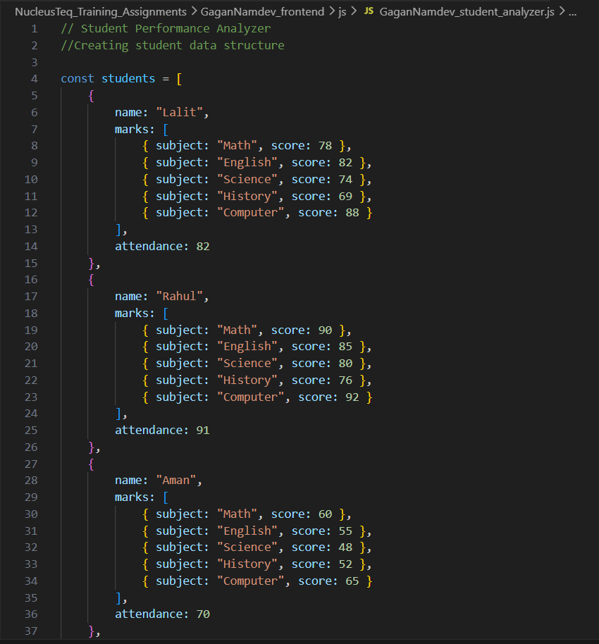
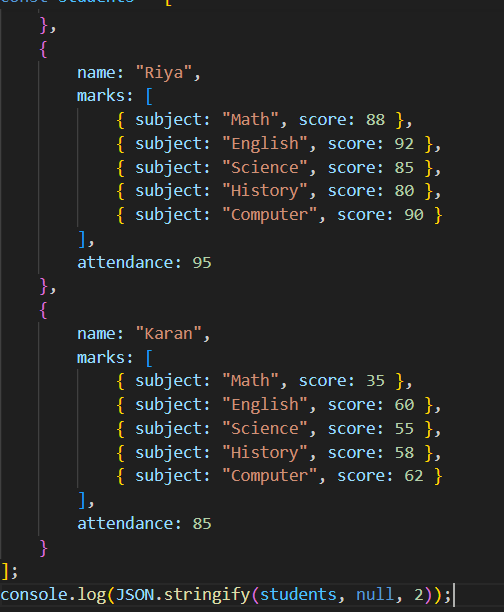

### Output Screenshots
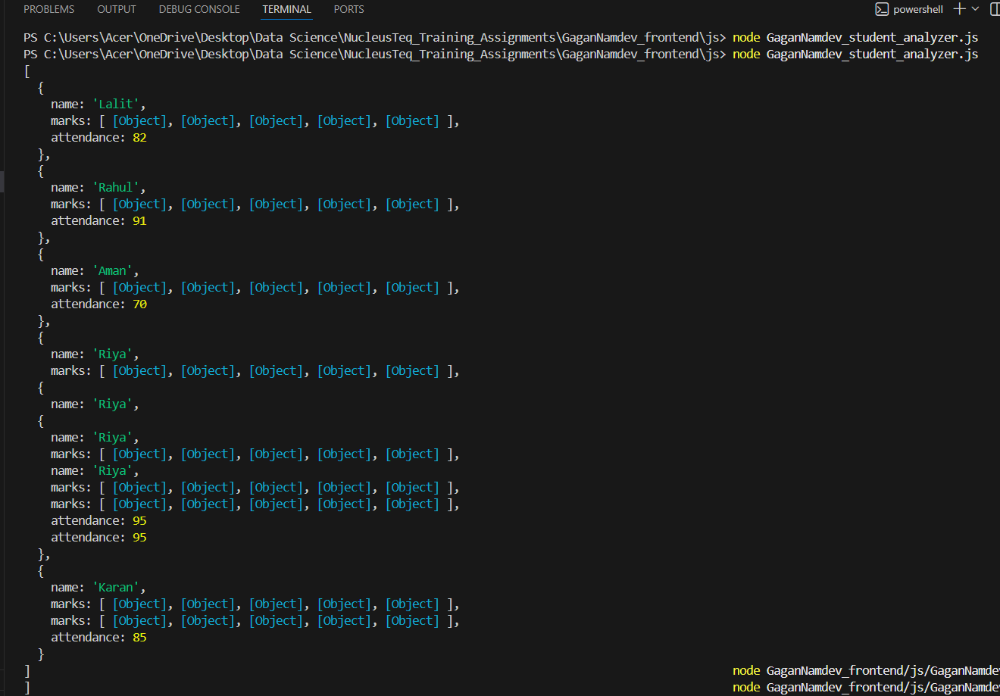

# Calculate Total Marks

This function calculates the total marks of a student by looping through all subjects and summing their scores.
### code
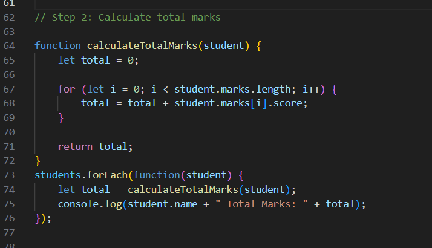
### output
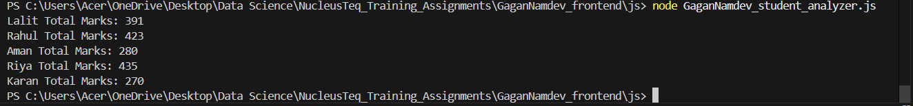

# Calculate Average Marks

This function calculates the average marks of a student.

It uses the total marks function
Divides total marks by number of subjects
Returns the average score of the student.
### code
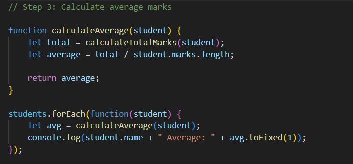
### output
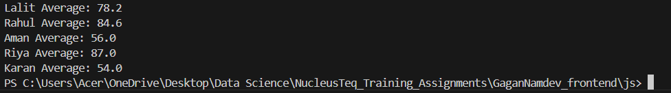

# Subject-wise Highest Score

This block finds the highest scorer in each subject.

Loops through each subject
Compares scores of all students
Stores the highest score and student name
Outputs topper for each subject.
### Topper Output
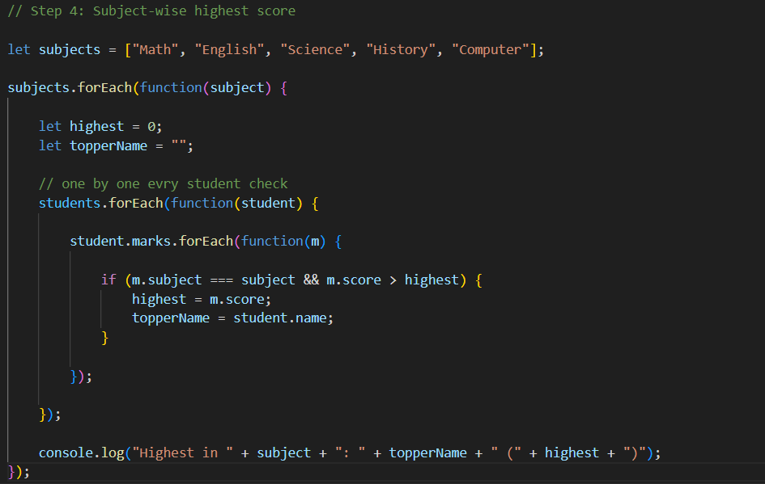

### output
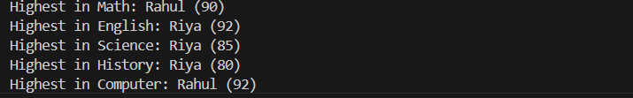

# Subject-wise Average Score

This block calculates the average score for each subject.

Adds marks of all students for a subject
Divides by total number of students
Gives overall class performance per subject.
### code 
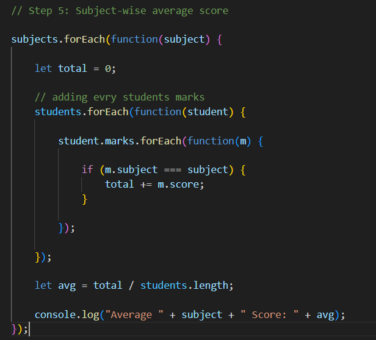
### output
.png)

# Class Topper

This block identifies the overall class topper.
Calculates total marks of each student
Compares and finds highest total
Outputs student with maximum marks.
### code
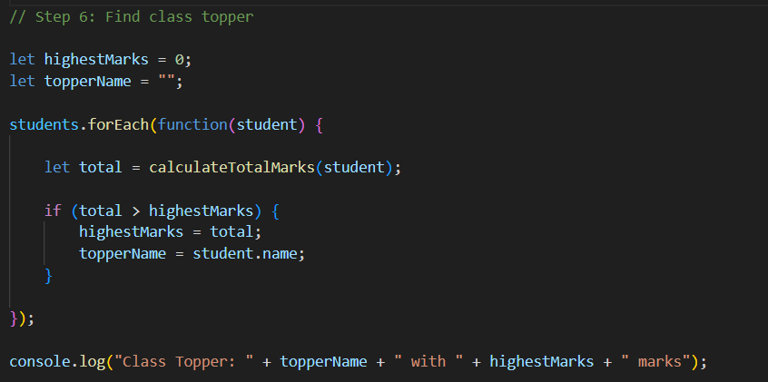
### output
.png)

# Grade Calculation

This function assigns grades based on performance.

Conditions:

Fail if any subject ≤ 40
Fail if attendance < 75
Otherwise:
A (≥ 85)
B (≥ 70)
C (≥ 50)
Fail (< 50)

Returns final grade of each student.
### Grade code
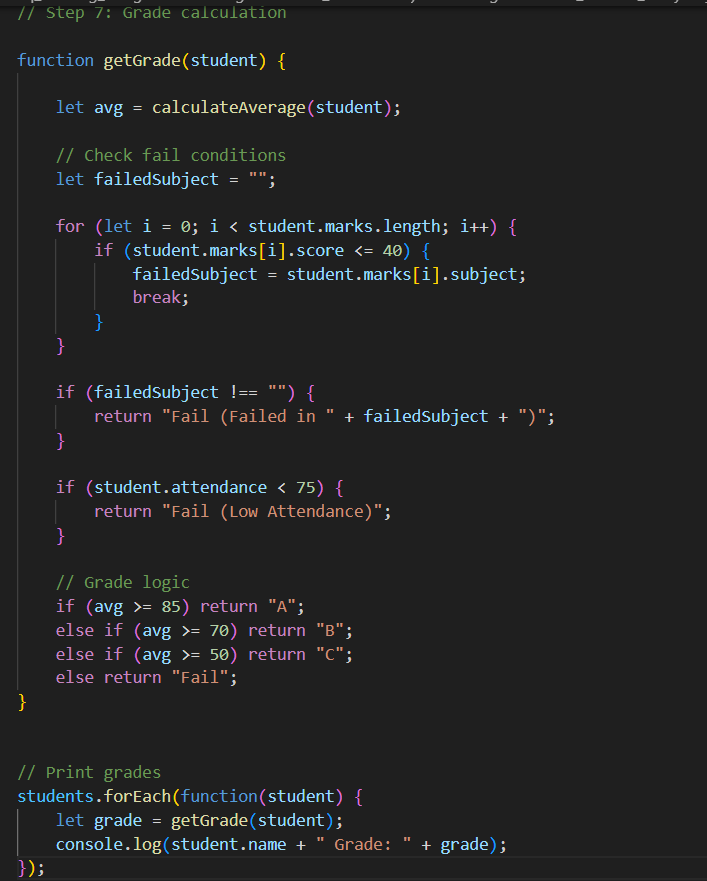
### Grade Output
.png)

## My Learning
While building this project, I understood how to work with arrays, objects, loops, and conditions.  
I also learned how to structure logic step by step.